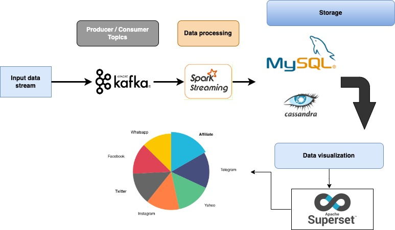

# Kafka and Sparka streaming data in Python #



## Dependencies and packages ##

Install and run Kafka 
#### install and run kafka according to the basic recommendations at [apache-kafka.org](https://kafka.apache.org/quickstart) ####

* Download Kafka and change directory 
      
   ```console 
   tar -xzf kafka_2.13-3.2.0.tgz
   cd kafka_2.13-3.2.0
   ```
   
In the second console run this command for starting kafka environment
````console
bin/zookeeper-server-start.sh config/zookeeper.properties
````
Open another terminal session
````console
bin/kafka-server-start.sh config/server.properties
````
Once all services have **successfully** launched, you will have a basic Kafka environment running and ready to use.

### Create your topic and run the producer orders ###
```console
bin/kafka-topics.sh --create --topic orderstopicdemo --replication-factor 1 --partitions 1 --bootstrap-server localhost:9092
```
Run producer
```console
bin/kafka-console-producer.sh --topic orderstopicdemo --bootstrap-server localhost:9092
```

2. Install and run Spark or Pyspark
Installation [pyspark](https://spark.apache.org/docs/latest/api/python/getting_started/install.html#using-pypi) 

```console 
pip install pyspark
```

3. Storage,you have to choose what engine to install and run either MySQL or Cassandra
   **For this small project, one order per second, MySQL ia very enough but for big project
   it is necessary to ask the question of high performance and availability. Cassandra would be a better asset**

Create table in MySQL for storage data.
```console
mysql -u root -p
```
```console
mysql> create table total_sales_by_source_state (source varchar(100), state varchar(100), total_sum_amount double, processed_at datetime, batch_id int(11));
```
For Cassandra 
Install Cassandra [link](https://cassandra.apache.org/doc/latest/cassandra/getting_started/installing.html)
Install cqlsh (cassandra query language Shell) [link](https://pypi.org/project/cqlsh/)
```console
cqlsh
```
```console
cqlsh> CREATE KEYSPACE sales_ks WITH replication = {'class': 'SimpleStrategy', 'replication_factor':1};
```
```console
cqlsh> use sales_ks ;
```
```console
cqlsh:sales_ks> CREATE TABLE sales_ks.orders(order_id int PRIMARY KEY , created_at text, discount text, product_id text, quantity text, subtotal text, tax text, total text, customer_id int);
```
## For ingestion data ##
A product order data generator for customers.
In the python script ```console python generate_csv.py```, products, 
customers and random orders are created.

**[Kafka](https://kafka.apache.org/)**
___
Apache Kafka is an open-source distributed event streaming platform used by thousands of companies for high-performance data pipelines, streaming analytics, 
data integration, and mission-critical applications.

**[Spark](https://spark.apache.org/)**
___
Apache Spark™ is a multi-language engine for executing data engineering, data science, 
and machine learning on single-node machines or clusters.

**[Superset](https://superset.apache.org/)**
Apache Superset is a modern data exploration and visualization platform

________

Now we can run the python script in order
1. generate_cvs.py
2. kafka_producer.py
3. data_processing.py

#### Generate CSV ####
```console
python generate_csv.py
```
## Data Processing ###
```console
python kafka_producer.py
```
```console
python data_processing.py
```
## Data Visualization ##
We use apache superset to connect to dbs (MySQL).

example: **Viz Total sales by sources**


